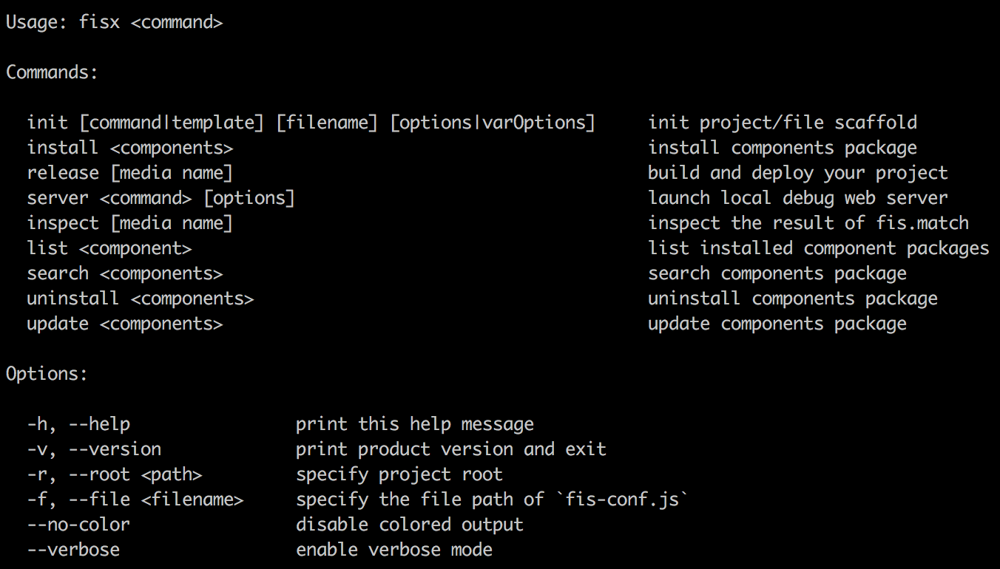
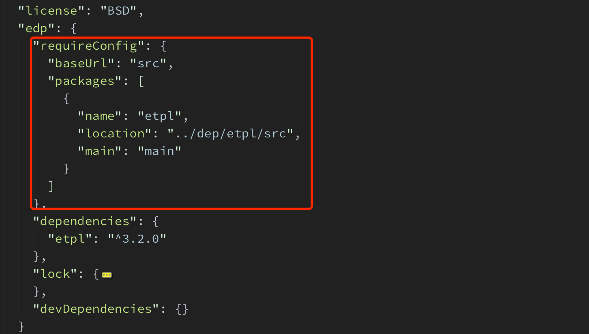
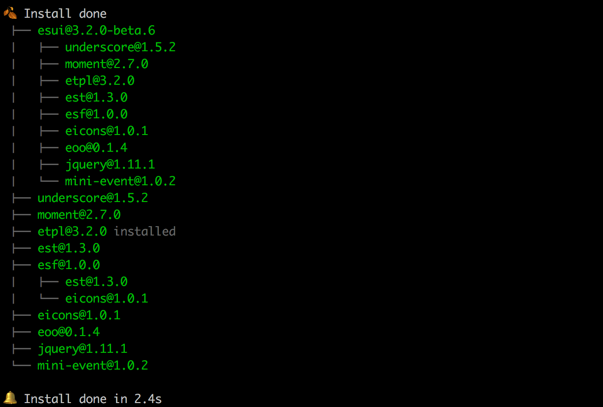
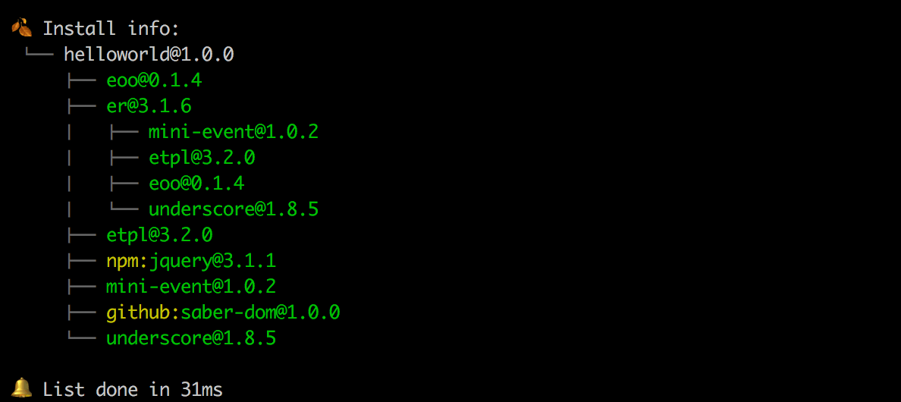

## 快速上手

> FISX 是基于 FIS3 和 EFE 规范 前端定制解决方案，提供项目打包构建、开发调试、包管理等一整套前端开发流程的解决方案。

`FISX` 是基于 [FIS3](http://fis.baidu.com) 的定制解决方案，关于 `FIS3` 使用和原理可以参考 [FIS3](http://fis.baidu.com/fis3/docs/beginning/intro.html) 官网，本文档主要介绍 `FISX` 核心的一些功能特性。同样的 `FIS3` 提供的[插件](http://fis.baidu.com/fis3/plugins.html)也可以用在 `FISX`。

### 安装

**注意：** 要求 node 版本必须 `>=4.0`

```
npm i fisx -g
```

安装完成后，可以执行如下命令查看版本号及可用的命令选项：

```
fisx -v
fisx -h
```



### 初始化项目

默认 `FISX` 预定义了一些常见项目的模板（脚手架），可以帮助我们快速初始化一个项目。脚手架预定义模板可以参考[这里](https://github.com/fisx-scaffold)。

```
mkdir helloworld
cd helloworld

# 初始化一个简单项目，使用默认的 simple 模板
fisx init

# 初始化一个 node 包项目
fisx init npm

# 初始化一个 vue1.x 项目
fisx init vue1

# 初始化一个 vue2 项目
fisx init vue

# 初始化一个 react 项目
fisx init react
```

由于模板安装来源来自于网络，`FISX` 默认会缓存下载的模板，如果想强制使用最新的模板可以使用如下选项：

```
fisx init --latest
```

或者也可以使用缓存清理命令来清理缓存的脚手架模板或者组件包，具体可以通过下面命令查看具体使用：

```
fisx cache -h
```


关于更多初始化脚手架命令可以执行如下命令：

```
fisx init -h
```


### 项目结构

```
helloworld
├── README.md        (项目说明文件)
├── dep              (依赖的第三方资源)
├── doc              (存放项目文档)
├── fis-conf.js      (fisx 的构建配置文件)
├── index.html         
├── mock             (mock 目录)
├── package.json     (NPM 包描述信息)
├── server-conf.js   (本地开发调试服务器配置文件)
├── src              (开发时的源码存放目录)
│   ├── common       
│   │   ├── css
│   │   └── util
│   ├── index.less
│   └── main.js
├── test             (项目测试用例存放目录)
└── tool             (项目开发构建使用的工具存放目录)
```

详细目录规范，参考 [EFE 目录规范](https://github.com/ecomfe/spec/blob/master/directory.md)

### 依赖管理

**注意：** 默认依赖包安装仓库源是 [EDP Registry](http://edp-registry.baidu.com/)

`FISX` 运行时是基于 [AMD 规范](https://github.com/amdjs/amdjs-api/wiki/AMD) 的 [ESL](https://github.com/ecomfe/esl) 模块加载器。`AMD` 加载配置信息是由 `FISX` 来自动管理的，定义在 `package.json` 里，开发调试及打包时候自动注入到页面里。包依赖更新时候会自动更新该配置信息，具体存储结构如下，详细 `AMD` 模块加载配置定义可以参考 [ESL 配置](https://github.com/ecomfe/esl/blob/master/doc/config.md)。



* 安装依赖

    ```
    # 如果 pacakge.json 已经定义了依赖信息，依赖还未安装可以执行该命令初始化
    fisx install
    
    fisx install etpl
    # 等价于
    # fisx install edp:etpl
    
    # 安装来自于 npm 的包
    # fisx install npm:jquery
    
    # 安装来自于 github 的包
    # fisx install ecomfe/moye
    
    # 查看命令使用
    fisx install -h
    ```
    
    

* 移除依赖

    ```
    fisx uninstall etpl --save
    ```
        
* 更新依赖

    ```
    fisx update etpl
    ```    
      
* 搜索包
        
   ```
   # 搜索 edp registry 的包
   fisx search esui
   
   # 搜索 github 上的包
   fisx search github:esui
   ```
        
* 查看依赖

    ```
    fisx list
    ```
    
    


### 模块开发规范

`FISX` 推荐所有开发依赖都放在 `dep` 下，其他非线上依赖都放在 `node_modules` 下，因此如果项目中想要引用 `NPM` 包，需要通过 `FISX` 提供的包安装工具进行安装管理。`FISX`虽然运行时时是基于 `AMD` 规范，但开发源码并不限制所使用的模块规范，允许使用 `AMD`、`CommonJS` 规范，甚至混合使用，因此如果你的依赖是一个 `CommonJS` 规范的依赖包，也一样能支持。如果项目使用的是最新 `ES6` 语法模块规范，可以通过使用 `babel` 先进行预编译处理。

由于 `FISX` 支持两种开发调试模式，具体可以参考下面，因此需要能够同时支持在打包构建和运行时做转换处理。

* 打包构建转换处理，主要在 `fis-conf.js` 构建配置文件加上相应的处理

    ```
    fis.match('/src/(**.js)', {
        // 使用 es6 语法可以用 babel6 转换下
        parser: fis.plugin('babel6', {
            speed: true,
            sourceMaps: false
        }),
        
        preprocessor: [
            fis.plugin('babel'),
            
            // 将 commonjs 规范转成 amd 规范
            fis.plugin('amd', {
                // 是否要规范化 require 的模块 id，
                // 使得前端 AMD Loader 能正确加载到模块文件
                resolveRequire: false,
                
                // 移除 css 依赖的声明
                clearCssRequire: true
            })
        ]
    });
    ```
    
    如果项目中不止是简单的移除 `define` 包裹语法，还使用 `CommonJS` 模块查找机制（不支持 `CommonJS` node_modules 目录递归查询机制），可以将 `resolveRequire` 设为 `true`。

* 运行时转换处理，主要在 `server-conf.js` 配置文件 `getLocations` 方法加上相应的处理

    ```
    // babelProcessor, cjs2amd 为 FISX 扩展的自定义 edp-webserver 全局处理器
    var babelHandlers = babelProcessor({
        sourceMap: false,
        requireCss: {
            inline: true
        }
    });
    
    return [
        // other location handlers...
        {
            path: /\/dep\/.*\.js$/,
            handler: [
                file(),
                cjs2amd.create({
                    resolveRequire: true
                })
            ]
        },
        babelHandlers.babel
        // ...
    ];
    ```

`FISX` 允许代码里直接 `require` 依赖的样式文件，构建打包阶段，会将其打包到最终打包的样式文件，并将其声明从模块代码里移除。运行时，允许将样式代码以内联方式插入到页面中或者通过外部文件加载方式加载样式。

```
// 声明依赖的样式
import './modal.styl';

import $ from 'jquery';
import {encodeHTML} from '../util';

// ...
export default {};
```

### 本地开发调试

本地开发调试 Server 使用 [EDP WebServer](https://github.com/ecomfe/edp-webserver)，对应的本地 Server 配置文件为 `server-conf.js`。关于 `EDP WebServer` 的相关配置的使用，可以参考[这里](https://github.com/ecomfe/edp/wiki/WebServer)。

* 基于源码的开发调试 `推荐方式`

    ```
    fisx server start
    ```
    
    该模式下支持模块热替换 `HMR` 和 `livereload`。
    
* 基于发布代码进行开发调试 `FIS3 支持模式`
    
    ```
    # 发布代码，并开启代码更新自动编译 和 livereload
    fisx release -wL
    
    # 以发布代码模式进行开发调试
    fisx server start --release
    
    ```

* 本地请求数据 mock

    本地请求 `mock` 使用的是 [autoresponse](https://github.com/wuhy/autoresponse) 中间件，具体可以看到 `server-conf.js` 的 `getLocations` 定义里存在如下配置，就是用来拦截请求进行 `mock` 处理的。默认配置为对所有 `post` 请求进行数据 `mock` 处理，对应的 `mock` 数据响应处理文件在 `mock` 目录下，文件路径同 `post` 请求路径。第一次请求如果 `mock` 数据文件不存在会自动创建 `mock` 数据文件。更多关于 `autoresponse` 配置和使用可以参考 [这里](https://github.com/wuhy/autoresponse)。
    
    ```
    // 添加 mock 处理器
    autoresponse('edp', {
        logLevel: 'debug',
        root: __dirname,
        handlers: requireInjector,
        post: true
    })
    ```

* 使用 `HMR` 和 `livereload`

    具体配置定义在 `server-conf.js`，如果不想使用设置 `watchreload` 为 `false`，如果要开启 `HMR`，把 `HMR` 设为 `true`。
    
    ```
    // disable watchreload setting false
    exports.watchreload = {
        hmr: false,
        files: [ // 定义要监听的文件
            'src/**/*',
            'index.html'
        ]
    };
    ```


### 打包发布

构建打包配置文件定义在 `fis-conf.js`，默认 `FISX` 提供如下默认配置定义：

* 所有开发的源文件最后会打包到 `asset` 目录下，即打包输出的 `src` 目录名会被改写成 `asset`

* 默认生产环境会对所有 `js`、`css`、`png` 后缀文件进行压缩

* 默认会对所有 `js` 后缀文件及图片文件路径加上 `MD5` hash 值

* 默认所有未被编译处理的非 `css` 后缀的样式文件都不会被输出到发布目录

* `FISX` 默认会对于一些常见的非线上的资源文件进行忽略处理，比如项目打包配置文件、`node_modules` 目录等

* 打包阶段默认会使用雪碧图合并打包处理

---

通过如下定义配置，指定要处理的页面入口的预处理语言的样式文件：

```
var pageFiles = ['index.html'];

// 初始化要编译的样式文件: 只处理页面引用的样式文件
fis.initProcessStyleFiles(pageFiles, {});
```

---

基于以上默认配置，如果想改写只需覆盖定义即可 或者 增加额外要处理的文件：

```
// .min.js 文件后缀的文件不压缩
fis.media('prod').match('/dep/**.min.js', {
    optimizer: null
});

// 对于单独在模块声明的依赖样式文件，需要这里单独声明处理下
fis.match('/src/common/{biz,ui}/**.styl', {
    parser: fis.plugin('stylus', stylusOpts),
    rExt: '.css',
    relative: true
});
fis.media('prod').match('/src/common/{biz,ui}/**.styl', {
    optimizer: fis.plugin('css-compressor')
});

```

---

打包配置，目前 `FISX` 支持单页面应用的打包和多页面打包配置，对于异步按需加载的支持待完善支持。由于 `FIS3` 实现策略，目前对于打包到目标文件如果是已经存在的文件，最终会变成打包到该文件名加上 `_aio` 文件的目标文件。

```
var pageFiles = ['/templates/**/*.tpl', '/templates/*.tpl'];

// ...

fis.match('::package', {
    // 打包相关配置
    packager: fis.plugin('static', {
        // 自定义打包要输出重写的模块配置信息
        amdConfig: {
            baseUrl: urlPrefix + '/asset'
        },

        // 内联 `require.config`
        inlineResourceConfig: true,

        // 按页面打包
        page: {
            files: pageFiles,
            
            // 打包页面异步入口模块，默认打包到入口模块里
            packAsync: true,
            
            // 打包页面模块依赖的样式，默认打包到页面引用的样式文件里
            packDepStyle: true,
            
            // 按页面提取第三方依赖的模块打包成一个文件
            extractVendor: true
        }
    })
});
```

---

* 禁用压缩模式发布

    ```
    fisx release 
    ```
    
* 开启压缩生产环境发布

    ```
    fisx release prod
    ```
    
* 关闭增量编译
    
    ```
    fisx release -c
    ```


## 包管理

// TODO

// 详细包管理使用

## 架手架

// TODO

// 使用 和 扩展

## 开发调试

// TODO

// 详细开发调试介绍

## 打包构建

// TODO

// 详细打包构建配置介绍

## 项目实践

// TODO

// 各种技术栈项目最佳实践介绍

## 命令行

// TODO

// FISX 命令行 介绍

## 扩展开发

// TODO

// FISX 扩展开发介绍

## TODO List

// TODO

## 版本记录

// TODO
